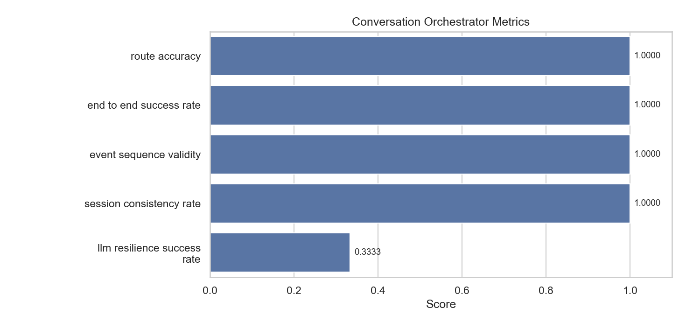

# conversation_orchestrator

- Status: `WARN`

## Metrics

| Metric                      |   Value |
|-----------------------------|---------|
| route_accuracy              |  1      |
| end_to_end_success_rate     |  1      |
| event_sequence_validity     |  1      |
| session_consistency_rate    |  1      |
| llm_resilience_success_rate |  0.3333 |

## Metric Definitions

| Metric                      | Calculation                                                                                                                      |
|-----------------------------|----------------------------------------------------------------------------------------------------------------------------------|
| route_accuracy              | route_accuracy = scenarios_with_exact_expected_route / total_scenarios                                                           |
| end_to_end_success_rate     | end_to_end_success_rate = scenarios_with_expected_final_module_and_response_type / total_scenarios                               |
| event_sequence_validity     | event_sequence_validity = scenarios_where_route_starts_with_intent_router_and_ends_with_final_module / total_scenarios           |
| session_consistency_rate    | session_consistency_rate = scenarios_with_non_empty_session_id / total_scenarios                                                 |
| llm_resilience_success_rate | llm_resilience_success_rate = resilience_scenarios_with_expected_route_subsequence_and_final_module / total_resilience_scenarios |

## Threshold Checks

| Metric | Threshold | Level | Actual | Result |
| --- | --- | --- | --- | --- |
| `route_accuracy` | `>= 0.95` | blocking | `1.0000` | PASS |
| `end_to_end_success_rate` | `>= 0.90` | blocking | `1.0000` | PASS |
| `event_sequence_validity` | `= 1.00` | blocking | `1.0000` | PASS |
| `session_consistency_rate` | `= 1.00` | blocking | `1.0000` | PASS |
| `llm_resilience_success_rate` | `>= 0.95` | warning | `0.3333` | WARN |

## Charts

## Notes

- Scenarios cover blocked inputs, nursing consultation, product browsing, and problem-solving recommendation flows.
- Session consistency checks that each orchestration result is bound to a persisted session identifier.
- LLM resilience scenarios verify that orchestration still reaches the expected downstream module when an LLM path degrades.
- Blocking metrics fail the regression immediately; warning metrics are surfaced as WARN in the report.
- Warning threshold misses: `llm_resilience_success_rate=0.3333 (>= 0.95)`
