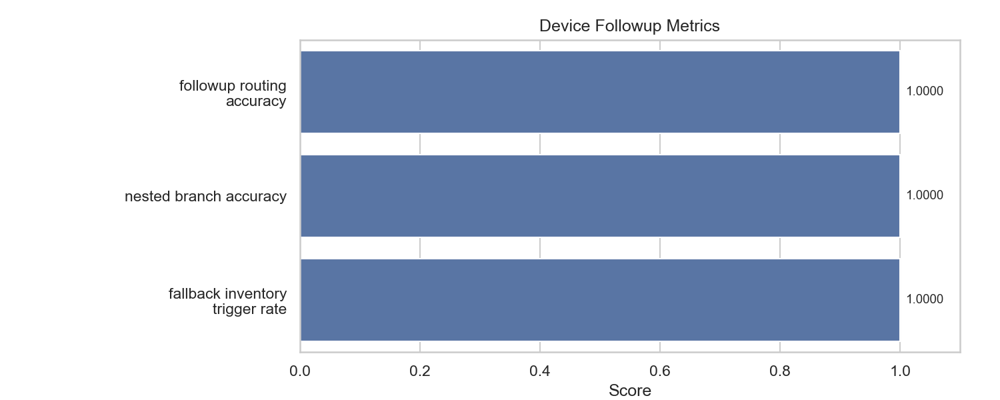

# device_followup

- Status: `PASS`

## Metrics

| Metric                          |   Value |
|---------------------------------|---------|
| followup_routing_accuracy       |       1 |
| nested_branch_accuracy          |       1 |
| fallback_inventory_trigger_rate |       1 |

## Metric Definitions

| Metric                          | Calculation                                                                             |
|---------------------------------|-----------------------------------------------------------------------------------------|
| followup_routing_accuracy       | followup_routing_accuracy = correctly_routed_first_level_cases / total_initial_cases    |
| nested_branch_accuracy          | nested_branch_accuracy = correctly_resolved_nested_cases / total_nested_cases           |
| fallback_inventory_trigger_rate | fallback_inventory_trigger_rate = successful_inventory_fallbacks / total_fallback_cases |

## Threshold Checks

| Metric | Threshold | Level | Actual | Result |
| --- | --- | --- | --- | --- |
| `followup_routing_accuracy` | `= 1.00` | blocking | `1.0000` | PASS |
| `nested_branch_accuracy` | `= 1.00` | blocking | `1.0000` | PASS |
| `fallback_inventory_trigger_rate` | `>= 0.95` | warning | `1.0000` | PASS |

## Charts

## Notes

- Covers recommend, nested, no-product, redirect, and fallback flows.
- Blocking metrics fail the regression immediately; warning metrics are surfaced as WARN in the report.
- Warning thresholds: all satisfied.
