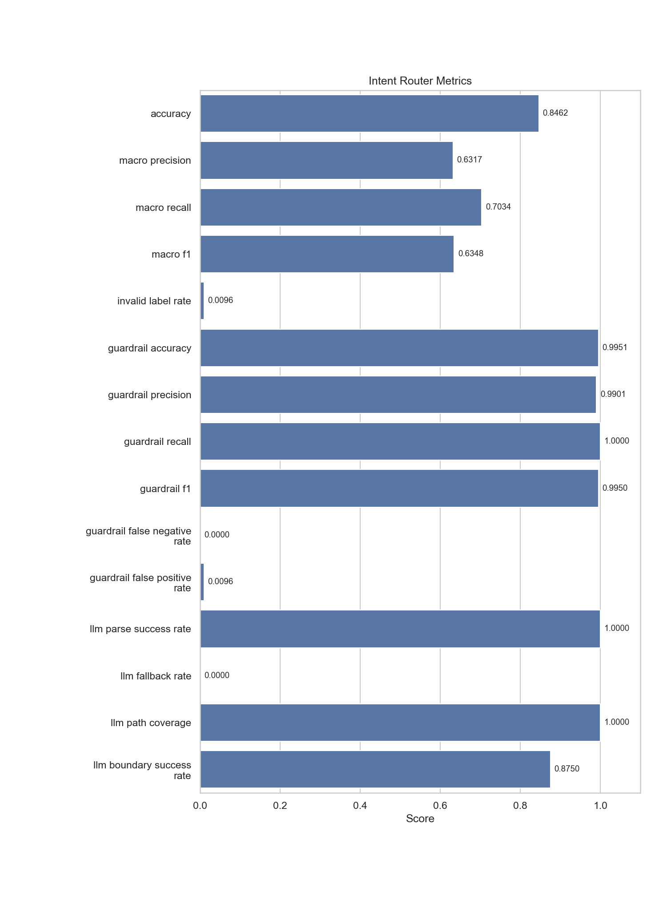

# intent_router

- Status: `PASS`

## Metrics

| Metric                        |   Value |
|-------------------------------|---------|
| accuracy                      |  0.8462 |
| macro_precision               |  0.6317 |
| macro_recall                  |  0.7034 |
| macro_f1                      |  0.6348 |
| invalid_label_rate            |  0.0096 |
| guardrail_accuracy            |  0.9951 |
| guardrail_precision           |  0.9901 |
| guardrail_recall              |  1      |
| guardrail_f1                  |  0.995  |
| guardrail_false_negative_rate |  0      |
| guardrail_false_positive_rate |  0.0096 |
| llm_parse_success_rate        |  1      |
| llm_fallback_rate             |  0      |
| llm_path_coverage             |  1      |
| llm_boundary_success_rate     |  0.875  |

## Metric Definitions

| Metric                        | Calculation                                                                                       |
|-------------------------------|---------------------------------------------------------------------------------------------------|
| accuracy                      | intent_accuracy = correct_intent_predictions / total_intent_samples                               |
| macro_precision               | macro_precision = arithmetic mean of per-class precision across all intent labels                 |
| macro_recall                  | macro_recall = arithmetic mean of per-class recall across all intent labels                       |
| macro_f1                      | macro_f1 = arithmetic mean of per-class F1 across all intent labels                               |
| invalid_label_rate            | invalid_label_rate = invalid_predicted_labels / total_intent_samples                              |
| guardrail_accuracy            | guardrail_accuracy = (TP + TN) / (TP + TN + FP + FN), with `block` as positive class              |
| guardrail_precision           | guardrail_precision = TP / (TP + FP), with `block` as positive class                              |
| guardrail_recall              | guardrail_recall = TP / (TP + FN), with `block` as positive class                                 |
| guardrail_f1                  | guardrail_f1 = 2 * precision * recall / (precision + recall)                                      |
| guardrail_false_negative_rate | guardrail_false_negative_rate = FN / (TP + FN)                                                    |
| guardrail_false_positive_rate | guardrail_false_positive_rate = FP / (FP + TN)                                                    |
| llm_parse_success_rate        | llm_parse_success_rate = parseable_llm_outputs / total_llm_attempts                               |
| llm_fallback_rate             | llm_fallback_rate = llm_attempts_that_fell_back_to_heuristic / total_llm_attempts                 |
| llm_path_coverage             | llm_path_coverage = llm_enabled_safe_cases / total_safe_boundary_cases                            |
| llm_boundary_success_rate     | llm_boundary_success_rate = boundary_cases_with_expected_or_allowed_intent / total_boundary_cases |

## Guardrail Confusion Matrix

| Actual \ Predicted   |   Allow |   Block |
|----------------------|---------|---------|
| Allow                |     103 |       1 |
| Block                |       0 |     100 |

## Intent Confusion Matrix

| Actual \ Predicted   |   Nursing |   Problem Solving |   Browsing |   Unclear |
|----------------------|-----------|-------------------|------------|-----------|
| Nursing              |        35 |                 1 |          0 |         7 |
| Problem Solving      |         1 |                28 |          1 |         1 |
| Browsing             |         1 |                 2 |         20 |         1 |
| Unclear              |         0 |                 0 |          0 |         5 |

## Threshold Checks

| Metric | Threshold | Level | Actual | Result |
| --- | --- | --- | --- | --- |
| `guardrail_false_negative_rate` | `<= 0.02` | blocking | `0.0000` | PASS |
| `guardrail_f1` | `>= 0.95` | blocking | `0.9950` | PASS |
| `macro_f1` | `>= 0.60` | warning | `0.6348` | PASS |
| `invalid_label_rate` | `<= 0.02` | warning | `0.0096` | PASS |
| `accuracy` | `>= 0.80` | warning | `0.8462` | PASS |
| `llm_parse_success_rate` | `>= 0.95` | warning | `1.0000` | PASS |
| `llm_boundary_success_rate` | `>= 0.85` | warning | `0.8750` | PASS |
| `llm_fallback_rate` | `<= 0.10` | observability | `0.0000` | PASS |

## Charts

## Notes

- Uses guardrail-first routing with an LLM-first classification path and heuristic fallback.
- Intent labels are compared against fixture regression data.
- Guardrail metrics use binary labels: `block` vs `allow`.
- LLM boundary metrics consume short, noisy, mixed-language fixture cases.
- Blocking metrics fail the regression immediately; warning metrics are surfaced as WARN in the report.
- Warning thresholds: all satisfied.
