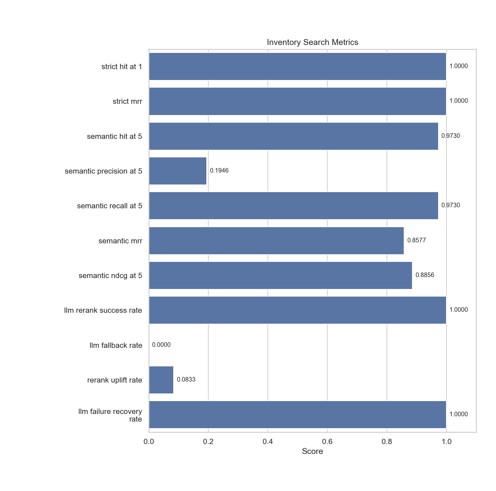

# inventory_search

- Status: `PASS`

## Metrics

| Metric                    |   Value |
|---------------------------|---------|
| strict_hit_at_1           |  1      |
| strict_mrr                |  1      |
| semantic_hit_at_5         |  0.973  |
| semantic_precision_at_5   |  0.1946 |
| semantic_recall_at_5      |  0.973  |
| semantic_mrr              |  0.8577 |
| semantic_ndcg_at_5        |  0.8856 |
| llm_rerank_success_rate   |  1      |
| llm_fallback_rate         |  0      |
| rerank_uplift_rate        |  0.0833 |
| llm_failure_recovery_rate |  1      |

## Metric Definitions

| Metric                    | Calculation                                                                                                   |
|---------------------------|---------------------------------------------------------------------------------------------------------------|
| strict_hit_at_1           | strict_hit_at_1 = strict_cases_with_correct_top_1 / total_strict_cases                                        |
| strict_mrr                | strict_mrr = mean(1 / rank_of_expected_product) across strict cases                                           |
| semantic_hit_at_5         | semantic_hit_at_5 = semantic_cases_with_relevant_item_in_top_5 / total_semantic_cases                         |
| semantic_precision_at_5   | semantic_precision_at_5 = mean(relevant_items_in_top_5 / 5) across semantic cases                             |
| semantic_recall_at_5      | semantic_recall_at_5 = mean(relevant_items_in_top_5 / relevant_items_total) across semantic cases             |
| semantic_mrr              | semantic_mrr = mean(1 / rank_of_first_relevant_item) across semantic cases                                    |
| semantic_ndcg_at_5        | semantic_ndcg_at_5 = mean(DCG@5 / IDCG@5) across semantic cases                                               |
| llm_rerank_success_rate   | llm_rerank_success_rate = llm_rerank_cases_with_expected_top_1 / total_llm_rerank_cases                       |
| llm_fallback_rate         | llm_fallback_rate = llm_rerank_cases_that_returned_local_baseline_due_to_llm_failure / total_llm_rerank_cases |
| rerank_uplift_rate        | rerank_uplift_rate = llm_rerank_cases_where_llm_corrected_a_non_top_1_baseline / total_llm_rerank_cases       |
| llm_failure_recovery_rate | llm_failure_recovery_rate = malformed_llm_cases_that_match_local_baseline / total_llm_fallback_cases          |

## Threshold Checks

| Metric | Threshold | Level | Actual | Result |
| --- | --- | --- | --- | --- |
| `strict_hit_at_1` | `>= 0.98` | blocking | `1.0000` | PASS |
| `strict_mrr` | `>= 0.95` | blocking | `1.0000` | PASS |
| `semantic_hit_at_5` | `>= 0.95` | blocking | `0.9730` | PASS |
| `semantic_recall_at_5` | `>= 0.95` | blocking | `0.9730` | PASS |
| `semantic_ndcg_at_5` | `>= 0.80` | warning | `0.8856` | PASS |
| `llm_rerank_success_rate` | `>= 0.90` | warning | `1.0000` | PASS |
| `llm_fallback_rate` | `<= 0.10` | observability | `0.0000` | PASS |
| `llm_failure_recovery_rate` | `>= 0.95` | warning | `1.0000` | PASS |

## Charts

## Notes

- Strict mode ranks exact product-name matches within category candidates.
- Semantic rerank mode uses category inference plus token and similarity scoring.
- LLM rerank metrics compare the LLM top-1 result against the local baseline top-1 result.
- Fallback cases validate that malformed LLM output returns to the local ranker result.
- Blocking metrics fail the regression immediately; warning metrics are surfaced as WARN in the report.
- Warning thresholds: all satisfied.
