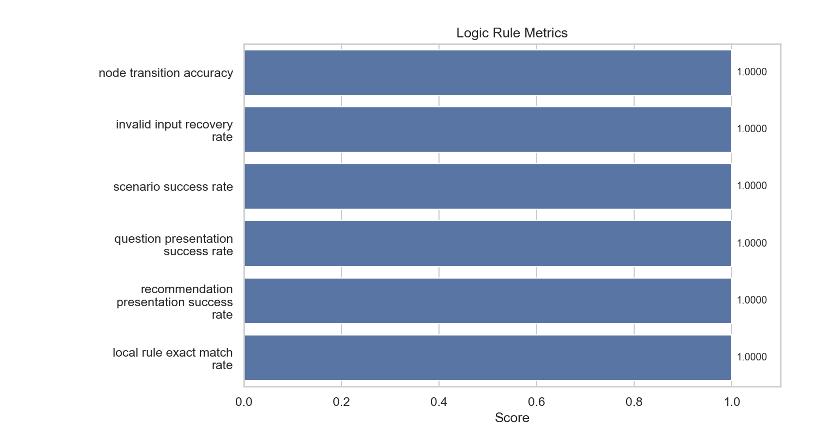

# logic_rule

- Status: `PASS`

## Metrics

| Metric                                   |   Value |
|------------------------------------------|---------|
| node_transition_accuracy                 |       1 |
| invalid_input_recovery_rate              |       1 |
| scenario_success_rate                    |       1 |
| question_presentation_success_rate       |       1 |
| recommendation_presentation_success_rate |       1 |
| local_rule_exact_match_rate              |       1 |

## Metric Definitions

| Metric                                   | Calculation                                                                                                                 |
|------------------------------------------|-----------------------------------------------------------------------------------------------------------------------------|
| node_transition_accuracy                 | node_transition_accuracy = correctly_matched_next_nodes / total_transition_cases                                            |
| invalid_input_recovery_rate              | invalid_input_recovery_rate = successful_reprompt_recoveries / total_invalid_input_cases                                    |
| scenario_success_rate                    | scenario_success_rate = successful_end_to_end_scenarios / total_scenario_cases                                              |
| question_presentation_success_rate       | question_presentation_success_rate = non_empty_question_presentations / total_question_presentation_cases                   |
| recommendation_presentation_success_rate | recommendation_presentation_success_rate = non_empty_recommendation_presentations / total_recommendation_presentation_cases |
| local_rule_exact_match_rate              | local_rule_exact_match_rate = presentations_equal_to_original_rule_text / total_presentation_cases                          |

## Threshold Checks

| Metric | Threshold | Level | Actual | Result |
| --- | --- | --- | --- | --- |
| `node_transition_accuracy` | `= 1.00` | blocking | `1.0000` | PASS |
| `scenario_success_rate` | `>= 0.95` | blocking | `1.0000` | PASS |
| `invalid_input_recovery_rate` | `>= 0.95` | warning | `1.0000` | PASS |
| `question_presentation_success_rate` | `>= 0.99` | warning | `1.0000` | PASS |
| `recommendation_presentation_success_rate` | `>= 0.99` | warning | `1.0000` | PASS |
| `local_rule_exact_match_rate` | `= 1.00` | observability | `1.0000` | PASS |

## Charts

## Notes

- Uses dictionary-based node transition instead of vector retrieval.
- Covers transitions, invalid input recovery, and full scenarios.
- Presentation metrics validate direct rendering from the local rule tree without LLM rewriting.
- Blocking metrics fail the regression immediately; warning metrics are surfaced as WARN in the report.
- Warning thresholds: all satisfied.
