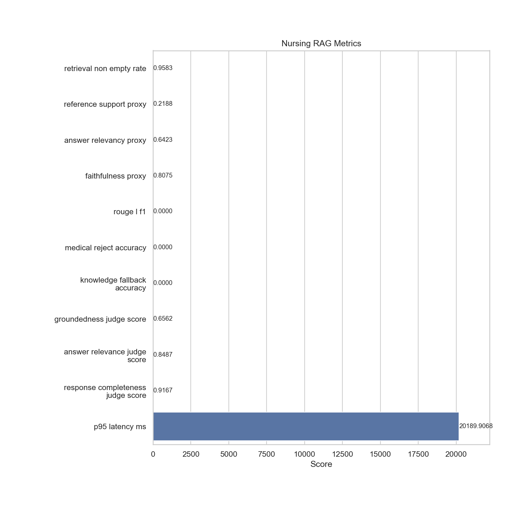

# nursing_rag

- Status: `FAIL`

## Metrics

| Metric                            |      Value |
|-----------------------------------|------------|
| retrieval_non_empty_rate          |     0.9583 |
| reference_support_proxy           |     0.2188 |
| answer_relevancy_proxy            |     0.6423 |
| faithfulness_proxy                |     0.8075 |
| rouge_l_f1                        |     0      |
| medical_reject_accuracy           |     0      |
| knowledge_fallback_accuracy       |     0      |
| groundedness_judge_score          |     0.6562 |
| answer_relevance_judge_score      |     0.8487 |
| response_completeness_judge_score |     0.9167 |
| p95_latency_ms                    | 20189.9    |

## Metric Definitions

| Metric                            | Calculation                                                                                                          |
|-----------------------------------|----------------------------------------------------------------------------------------------------------------------|
| retrieval_non_empty_rate          | retrieval_non_empty_rate = cases_with_non_empty_retrievals / total_cases                                             |
| reference_support_proxy           | reference_support_proxy = mean(keyword_overlap(reference_context, retrieved_contexts))                               |
| answer_relevancy_proxy            | answer_relevancy_proxy = mean(cosine_similarity(local_embedding(ground_truth), local_embedding(generated_answer)))   |
| faithfulness_proxy                | faithfulness_proxy = mean(cosine_similarity(local_embedding(generated_answer), local_embedding(retrieved_contexts))) |
| rouge_l_f1                        | rouge_l_f1 = mean(ROUGE-L F1 between ground_truth and generated_answer)                                              |
| medical_reject_accuracy           | medical_reject_accuracy = correctly_rejected_medical_cases / total_medical_reject_cases                              |
| knowledge_fallback_accuracy       | knowledge_fallback_accuracy = correctly_fallback_cases / total_knowledge_fallback_cases                              |
| groundedness_judge_score          | groundedness_judge_score = mean(ragas Faithfulness(answer, retrieved_contexts))                                      |
| answer_relevance_judge_score      | answer_relevance_judge_score = mean(ragas ResponseRelevancy(question, answer))                                       |
| response_completeness_judge_score | response_completeness_judge_score = mean(ragas SimpleCriteriaScore(question, answer, reference, retrieved_contexts)) |
| p95_latency_ms                    | p95_latency_ms = 95th percentile of end-to-end service.answer latency in milliseconds                                |

## Threshold Checks

| Metric | Threshold | Level | Actual | Result |
| --- | --- | --- | --- | --- |
| `retrieval_non_empty_rate` | `>= 0.95` | blocking | `0.9583` | PASS |
| `faithfulness_proxy` | `>= 0.60` | blocking | `0.8075` | PASS |
| `medical_reject_accuracy` | `= 1.00` | blocking | `0.0000` | FAIL |
| `knowledge_fallback_accuracy` | `>= 0.95` | blocking | `0.0000` | FAIL |
| `reference_support_proxy` | `>= 0.20` | warning | `0.2188` | PASS |
| `answer_relevancy_proxy` | `>= 0.40` | warning | `0.6423` | PASS |
| `groundedness_judge_score` | `>= 0.75` | warning | `0.6562` | WARN |
| `answer_relevance_judge_score` | `>= 0.85` | warning | `0.8487` | WARN |
| `response_completeness_judge_score` | `>= 0.80` | warning | `0.9167` | PASS |

## Charts

## Notes

- Retrieval uses Chroma persisted vectors with the shared embedding function from app.core.
- Answer generation uses the live business path with the backend OpenRouter configuration when contexts are available.
- Medical reject and knowledge fallback fixtures are evaluated separately from normal-answer samples.
- Judge metrics are executed with ragas over OpenRouter using evaluator model `openai/gpt-4.1` and local HuggingFace embeddings.
- Blocking metrics fail the regression immediately; warning metrics are still executed and surfaced as WARN in the report.
- Warning threshold misses: `groundedness_judge_score=0.6562 (>= 0.75)`, `answer_relevance_judge_score=0.8487 (>= 0.85)`
