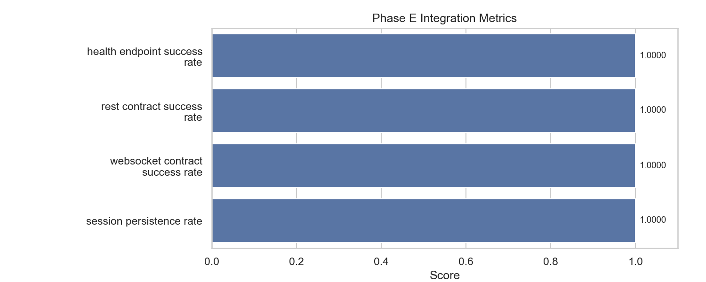

# phase_e

- Status: `PASS`

## Metrics

| Metric                          |   Value |
|---------------------------------|---------|
| health_endpoint_success_rate    |       1 |
| rest_contract_success_rate      |       1 |
| websocket_contract_success_rate |       1 |
| session_persistence_rate        |       1 |

## Metric Definitions

| Metric                          | Calculation                                                                                            |
|---------------------------------|--------------------------------------------------------------------------------------------------------|
| health_endpoint_success_rate    | health_endpoint_success_rate = successful_health_checks / total_health_checks                          |
| rest_contract_success_rate      | rest_contract_success_rate = successful_rest_contract_cases / total_rest_contract_cases                |
| websocket_contract_success_rate | websocket_contract_success_rate = successful_websocket_contract_cases / total_websocket_contract_cases |
| session_persistence_rate        | session_persistence_rate = successful_session_state_checks / total_session_state_checks                |

## Charts

## Notes

- Covers REST endpoints for session, intent, assessment, products, followup, inventory, and nursing.
- Covers websocket flows for assessment and nursing with real session binding.
