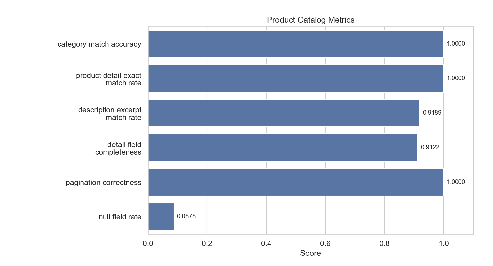

# product_catalog

- Status: `WARN`

## Metrics

| Metric                          |   Value |
|---------------------------------|---------|
| category_match_accuracy         |  1      |
| product_detail_exact_match_rate |  1      |
| description_excerpt_match_rate  |  0.9189 |
| detail_field_completeness       |  0.9122 |
| pagination_correctness          |  1      |
| null_field_rate                 |  0.0878 |

## Metric Definitions

| Metric                          | Calculation                                                                                                    |
|---------------------------------|----------------------------------------------------------------------------------------------------------------|
| category_match_accuracy         | category_match_accuracy = correctly_resolved_category_queries / total_category_browse_cases                    |
| product_detail_exact_match_rate | product_detail_exact_match_rate = exact_product_detail_hits / total_product_detail_cases                       |
| description_excerpt_match_rate  | description_excerpt_match_rate = cases_with_expected_excerpt_found_in_description / total_product_detail_cases |
| detail_field_completeness       | detail_field_completeness = non_empty_expected_fields / total_expected_fields                                  |
| pagination_correctness          | pagination_correctness = correct_pagination_cases / total_pagination_cases                                     |
| null_field_rate                 | null_field_rate = empty_expected_fields / total_expected_fields                                                |

## Threshold Checks

| Metric | Threshold | Level | Actual | Result |
| --- | --- | --- | --- | --- |
| `category_match_accuracy` | `>= 0.98` | blocking | `1.0000` | PASS |
| `product_detail_exact_match_rate` | `>= 0.95` | blocking | `1.0000` | PASS |
| `pagination_correctness` | `= 1.00` | blocking | `1.0000` | PASS |
| `detail_field_completeness` | `>= 0.95` | warning | `0.9122` | WARN |

## Charts

## Notes

- Category browse cases resolve category from natural-language queries.
- Detail cases validate exact product retrieval and expected field presence.
- Blocking metrics fail the regression immediately; warning metrics are surfaced as WARN in the report.
- Warning threshold misses: `detail_field_completeness=0.9122 (>= 0.95)`
